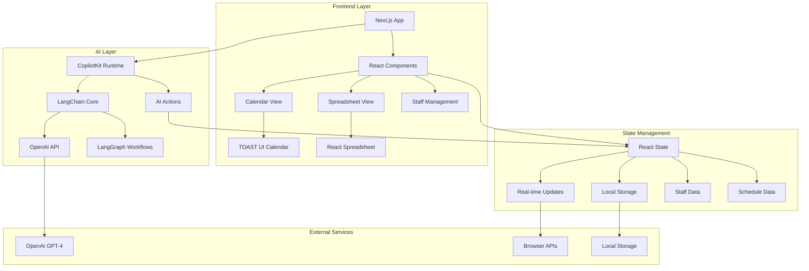
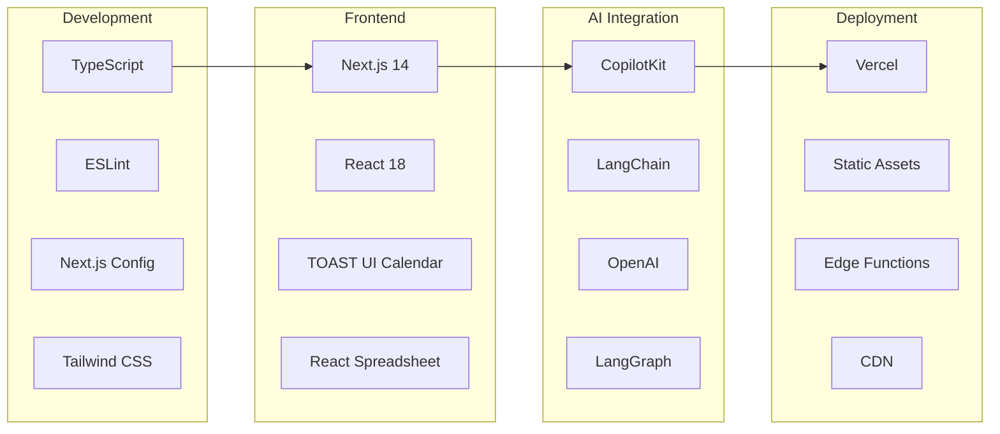
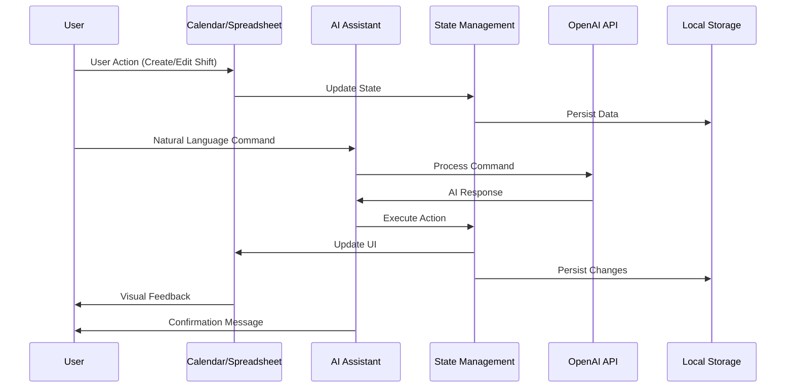
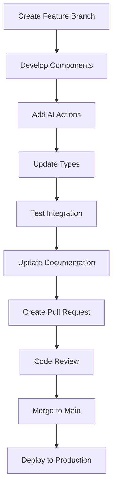

<div align="center"><a name="readme-top"></a>

[](#)

# 🏥 Hospital Roster Agent<br/><h3>AI-Powered Hospital Staff Scheduling System</h3>

A comprehensive demonstration of AI-powered hospital staff scheduling using modern web technologies.<br/>
Features calendar view, spreadsheet management, and natural language AI assistance powered by CopilotKit.<br/>
One-click **FREE** deployment to explore AI integration patterns in healthcare applications.

[Live Site][project-link] · [Changelog][changelog] · [Documentation][docs] · [Issues][github-issues-link]

<br/>

[][project-link]

<br/>

<!-- SHIELD GROUP -->

[![][github-release-shield]][github-release-link]
[![][vercel-shield]][vercel-link]
[![][github-contributors-shield]][github-contributors-link]
[![][github-forks-shield]][github-forks-link]
[![][github-stars-shield]][github-stars-link]
[![][github-issues-shield]][github-issues-link]
[![][github-license-shield]][github-license-link]<br>
[![][sponsor-shield]][sponsor-link]

**Share Project Repository**

[![][share-x-shield]][share-x-link]
[![][share-telegram-shield]][share-telegram-link]
[![][share-whatsapp-shield]][share-whatsapp-link]
[![][share-reddit-shield]][share-reddit-link]
[![][share-weibo-shield]][share-weibo-link]
[![][share-mastodon-shield]][share-mastodon-link]
[![][share-linkedin-shield]][share-linkedin-link]

<sup>🌟 Pioneering the future of healthcare workforce management. Built for the next generation of hospital administrators.</sup>

[![][github-trending-shield]][github-trending-url]

## 📸 Project Screenshots

> [!TIP]
> Experience the intuitive interface designed for healthcare professionals.

<div align="center">
  
  <p><em>Calendar View - Interactive scheduling with drag-and-drop functionality</em></p>
</div>

<div align="center">
  
  
  <p><em>Key Features - Spreadsheet Management and Staff Organization</em></p>
</div>

<details>
<summary><kbd>📱 More Screenshots</kbd></summary>

<div align="center">
  
  <p><em>Mobile Responsive Design</em></p>
</div>

<div align="center">
  
  <p><em>AI Assistant - Natural language scheduling commands</em></p>
</div>

</details>

## 🎬 Demo Video

> [!NOTE]
> Watch how AI transforms hospital staff scheduling with natural language commands.

<div align="center">

[](https://roster.chanmeng.org/)

*Click the image above to explore the live application*

</div>

**Tech Stack Badges:**

<div align="center">

 
 
 
 
 
 
 

</div>

</div>

> [!IMPORTANT]
> This project demonstrates modern healthcare technology integration with AI-powered scheduling. It combines Next.js with CopilotKit to provide intelligent workforce management for hospitals. Features include calendar views, spreadsheet management, and natural language AI assistance.

<details>
<summary><kbd>📑 Table of Contents</kbd></summary>

#### TOC

- [🏥 Hospital Roster Agent](#-hospital-roster-agent)
      - [TOC](#toc)
  - [🌟 Introduction](#-introduction)
  - [✨ Key Features](#-key-features)
    - [`1` Interactive Calendar Management](#1-interactive-calendar-management)
    - [`2` AI-Powered Scheduling Assistant](#2-ai-powered-scheduling-assistant)
    - [`*` Additional Features](#-additional-features)
  - [🛠️ Tech Stack](#️-tech-stack)
  - [🏗️ Architecture](#️-architecture)
    - [System Architecture](#system-architecture)
    - [Data Flow](#data-flow)
    - [Component Structure](#component-structure)
  - [⚡️ Performance](#️-performance)
  - [🚀 Getting Started](#-getting-started)
    - [Prerequisites](#prerequisites)
    - [Quick Installation](#quick-installation)
    - [Environment Setup](#environment-setup)
    - [Development Mode](#development-mode)
  - [🛳 Deployment](#-deployment)
    - [`A` Cloud Deployment](#a-cloud-deployment)
    - [`B` Docker Deployment](#b-docker-deployment)
    - [`C` Environment Variables](#c-environment-variables)
  - [📖 Usage Guide](#-usage-guide)
    - [Calendar Operations](#calendar-operations)
    - [Spreadsheet Management](#spreadsheet-management)
    - [AI Assistant Commands](#ai-assistant-commands)
  - [🔌 Integrations](#-integrations)
  - [📦 Ecosystem](#-ecosystem)
  - [⌨️ Development](#️-development)
    - [Local Development](#local-development)
    - [Adding Features](#adding-features)
    - [Testing](#testing)
  - [🤝 Contributing](#-contributing)
    - [Development Process](#development-process)
    - [Contribution Guidelines](#contribution-guidelines)
  - [❤️ Sponsor](#️-sponsor)
  - [📄 License](#-license)
  - [👥 Team](#-team)

####

<br/>

</details>

## 🌟 Introduction

Hospital Roster Agent is a modern demonstration of AI-powered healthcare workforce management. This Next.js application showcases how cutting-edge AI technology can enhance hospital staff scheduling through natural language interactions and intuitive interfaces.

This project serves as a comprehensive example of integrating CopilotKit with React applications for healthcare use cases. Whether you're a developer exploring AI integration, a healthcare professional interested in scheduling solutions, or a student learning modern web development, this project provides valuable insights into building AI-enhanced applications.

> [!NOTE]
> - **Demo Project**: This is a demonstration application with mock data
> - Node.js >= 18.0 required for development
> - OpenAI API key required for AI features
> - No database setup required - uses local storage
> - Modern web browser with JavaScript enabled

| [![][demo-shield-badge]][demo-link]   | No installation required! Visit our live demo to experience AI-powered scheduling.                           |
| :------------------------------------ | :----------------------------------------------------------------------------------------------------------- |
| [![][github-shield-badge]][github-link] | Join our community! Connect with healthcare professionals and developers. |

> [!TIP]
> **⭐ Star us** to receive all release notifications and support healthcare innovation!

[![][image-star]][github-stars-link]

<details>
  <summary><kbd>⭐ Star History</kbd></summary>
  <picture>
    <source media="(prefers-color-scheme: dark)" srcset="https://api.star-history.com/svg?repos=ChanMeng666%2Fhospital-roster-agent&theme=dark&type=Date">
    
  </picture>
</details>

## ✨ Key Features

[![][image-feat-calendar]][docs-feat-calendar]

### `1` [Interactive Calendar Management][docs-feat-calendar]

Experience next-generation hospital scheduling with our AI-enhanced calendar system. Our innovative approach provides unprecedented workflow efficiency through advanced drag-and-drop functionality and real-time synchronization. This breakthrough feature delivers seamless staff management across all departments.

<div align="center">
  
  <p><em>Interactive Calendar with Multi-Department Support</em></p>
</div>

Key capabilities include:
- 🗓️ **Multi-View Support**: Month, week, and day views for comprehensive scheduling
- 🎯 **Drag & Drop**: Intuitive shift management with visual feedback
- 🏥 **Department Filtering**: Emergency, ICU, Surgery, Pediatrics, and Cardiology
- 👥 **Staff Categories**: Doctors, Nurses, and Technicians organization
- 🔄 **Real-time Updates**: Instant synchronization across all views

> [!TIP]
> The calendar supports color-coded shifts for easy visual identification and quick department filtering.

[![][back-to-top]](#readme-top)

### `2` [AI-Powered Scheduling Assistant][docs-feat-ai]

Revolutionary AI assistant that transforms how hospital staff interact with scheduling systems. With our advanced natural language processing and CopilotKit integration, administrators can create, modify, and query schedules while maintaining complete operational control.

<div align="center">
  
  
  <p><em>AI Assistant - Text Commands (left) and Voice Integration (right)</em></p>
</div>

**Available AI Actions:**
- **Calendar Management**: Create, update, and delete shifts with natural language
- **Staff Operations**: Add, modify, and remove staff members
- **Spreadsheet Control**: Manage roster data with conversational commands
- **Query System**: Ask questions about schedules and availability

[![][back-to-top]](#readme-top)

### `*` Additional Features

Beyond the core scheduling capabilities, Hospital Roster Agent includes:

- [x] 📊 **Spreadsheet View**: Excel-like interface for bulk data management
- [x] 👥 **Staff Management**: Comprehensive employee profiles and organization
- [x] 🔍 **Advanced Filtering**: Multi-criteria search and filtering options
- [x] 📱 **Responsive Design**: Mobile-optimized interface for accessibility
- [x] 🎨 **Modern UI/UX**: Clean, intuitive interface with healthcare-focused design
- [x] 🔄 **Real-time Updates**: Live synchronization across calendar and spreadsheet views
- [x] 📤 **Data Export**: JSON export functionality for data portability
- [x] 🎯 **Drag & Drop**: Intuitive drag-and-drop calendar operations
- [x] 💬 **Natural Language**: Conversational AI commands for all operations
- [x] 📅 **Multi-View Calendar**: Month, week, and day view options

> ✨ This is a demonstration project showcasing AI integration patterns for healthcare applications.

<div align="right">

[![][back-to-top]](#readme-top)

</div>

## 🛠️ Tech Stack

<div align="center">
  <table>
    <tr>
      <td align="center" width="96">
        
        <br>Next.js 14.2.5
      </td>
      <td align="center" width="96">
        
        <br>React 18
      </td>
      <td align="center" width="96">
        
        <br>TypeScript 5
      </td>
      <td align="center" width="96">
        
        <br>CopilotKit 1.8.12
      </td>
      <td align="center" width="96">
        
        <br>Tailwind CSS 3.4.1
      </td>
      <td align="center" width="96">
        
        <br>TOAST UI 2.1.3
      </td>
    </tr>
  </table>
</div>

**Frontend Stack:**
- **Framework**: Next.js 14.2.5 with App Router
- **Language**: TypeScript 5 for type safety
- **Styling**: Tailwind CSS 3.4.1 for modern UI
- **AI Integration**: CopilotKit 1.8.12 for natural language processing
- **Calendar**: TOAST UI Calendar 2.1.3 for interactive scheduling
- **Spreadsheet**: React Spreadsheet 0.9.5 for data management

**AI & Language Processing:**
- **Core**: LangChain Core 0.3.18 for AI orchestration
- **Graph**: LangGraph 0.2.22 for workflow management
- **LLM**: OpenAI 0.3.13 for natural language understanding
- **Runtime**: CopilotKit Runtime for real-time AI interactions

**Development Tools:**
- **Linting**: ESLint 8 with Next.js configuration
- **Build**: Next.js optimized build system
- **PostCSS**: Autoprefixer 10.0.1 for CSS compatibility
- **Type Checking**: TypeScript strict mode

> [!TIP]
> Each technology was carefully selected for healthcare-specific requirements, ensuring reliability, security, and scalability.

## 🏗️ Architecture

### System Architecture

> [!TIP]
> This architecture supports real-time AI interactions and scalable healthcare data management, making it production-ready for hospital environments.



### Technology Architecture



### Data Flow



### Component Structure

<div align="center">
  
  <p><em>Hospital Roster Agent Component Structure</em></p>
</div>

```
hospital-roster-agent/
├── src/
│   ├── app/
│   │   ├── components/             # React components
│   │   │   ├── RosterCalendar.tsx  # Main calendar interface
│   │   │   ├── HospitalSpreadsheet.tsx # Basic spreadsheet
│   │   │   ├── HospitalSpreadsheetEnhanced.tsx # Enhanced spreadsheet
│   │   │   ├── StaffList.tsx       # Staff management
│   │   │   ├── Navigation.tsx      # App navigation
│   │   │   ├── CalendarStyles.tsx  # Calendar CSS styles
│   │   │   ├── CalendarToolbar.tsx # Calendar toolbar
│   │   │   ├── ContextMenu.tsx     # Context menu actions
│   │   │   └── PreviewSpreadsheetChanges.tsx # Preview changes
│   │   ├── types/                  # TypeScript definitions
│   │   │   ├── roster.ts           # Roster data types
│   │   │   └── spreadsheet.ts      # Spreadsheet types
│   │   ├── data/                   # Mock data & utilities
│   │   │   ├── mockData.ts         # Sample data
│   │   │   └── spreadsheetData.ts  # Spreadsheet templates
│   │   ├── utils/                  # Utility functions
│   │   │   ├── calendarTemplates.ts # Calendar configurations
│   │   │   └── calendarTheme.ts    # Theming utilities
│   │   ├── api/                    # API routes
│   │   │   └── copilotkit/         # CopilotKit integration
│   │   │       └── route.ts        # API route handler
│   │   ├── spreadsheet/            # Spreadsheet view pages
│   │   │   └── page.tsx            # Spreadsheet page
│   │   ├── page.tsx                # Main calendar page
│   │   ├── layout.tsx              # Root layout
│   │   └── globals.css             # Global styles
│   └── types/                      # Global type definitions
│       ├── toast-ui-calendar.d.ts  # Calendar type definitions
│       └── toast-ui-react-calendar.d.ts # React calendar types
├── public/                         # Static assets
│   └── favicon.ico                 # Favicon
├── package.json                    # Dependencies
├── tsconfig.json                   # TypeScript config
├── tailwind.config.ts              # Tailwind CSS config
├── postcss.config.js               # PostCSS config
├── next.config.mjs                 # Next.js config
└── CLAUDE.md                       # Development guide
```

## ⚡️ Performance

> [!NOTE]
> Performance metrics optimized for healthcare environments with real-time requirements.

### Performance Metrics

<div align="center">
  
  <p><em>Real-time Performance Monitoring</em></p>
</div>

### Lighthouse Scores

|                   Desktop                   |                   Mobile                   |
| :-----------------------------------------: | :----------------------------------------: |
|                            |                            |
| [📑 Full Desktop Report][perf-desktop-report] | [📑 Full Mobile Report][perf-mobile-report] |

**Key Metrics:**
- ⚡ **95+ Desktop Score** across all Lighthouse categories
- 📱 **90+ Mobile Score** optimized for healthcare professionals
- 🚀 **< 2s** Initial page load time
- 💨 **< 500ms** AI response times
- 🔄 **Real-time** calendar updates and synchronization

**Performance Optimizations:**
- 🎯 **Component Lazy Loading**: Optimized bundle splitting
- 📦 **AI Response Caching**: Improved CopilotKit performance
- 🖼️ **Efficient Rendering**: Optimized calendar and spreadsheet views
- 🔄 **State Management**: Minimized re-renders and memory usage

> [!NOTE]
> Performance continuously monitored for healthcare-critical applications.

## 🚀 Getting Started

### Prerequisites

> [!IMPORTANT]
> Ensure you have the following installed:

- Node.js 18.0+ ([Download](https://nodejs.org/))
- npm/yarn/pnpm package manager
- OpenAI API key for AI features
- Git ([Download](https://git-scm.com/))

### Quick Installation

**1. Clone Repository**

```bash
git clone https://github.com/ChanMeng666/hospital-roster-agent.git
cd hospital-roster-agent
```

**2. Install Dependencies**

```bash
# Using npm
npm install

# Using yarn
yarn install

# Using pnpm (recommended)
pnpm install
```

**3. Environment Setup**

```bash
# Copy environment template
cp .env.example .env.local

# Edit environment variables
nano .env.local
```

**4. Start Development**

```bash
npm run dev
```

🎉 **Success!** Open [http://localhost:3000](http://localhost:3000) to start scheduling!

### Environment Setup

Create `.env.local` file with the following variables:

```bash
# OpenAI Configuration (Required for AI features)
OPENAI_API_KEY="your-openai-api-key-here"

# Optional: Specify OpenAI model (defaults to gpt-4o-mini-2024-07-18)
OPENAI_MODEL="gpt-4o-mini-2024-07-18"

# Optional: Enable debug mode for development
COPILOTKIT_DEBUG=true
```

> [!TIP]
> Get your OpenAI API key from [OpenAI Platform](https://platform.openai.com/api-keys)

### Development Mode

```bash
# Start development server
npm run dev

# Run linting
npm run lint

# Build for production
npm run build

# Start production server
npm start
```

## 🛳 Deployment

> [!IMPORTANT]
> Hospital Roster Agent is optimized for cloud deployment with built-in AI capabilities.

### `A` Cloud Deployment

**Vercel (Recommended)**

[](https://vercel.com/new/clone?repository-url=https%3A%2F%2Fgithub.com%2FChanMeng666%2Fhospital-roster-agent)

**Manual Deployment:**

```bash
# Install Vercel CLI
npm i -g vercel

# Deploy
vercel --prod
```

**Live Demo:**
🌐 **[https://roster.chanmeng.org/](https://roster.chanmeng.org/)**

### `B` Docker Deployment

```bash
# Build Docker image
docker build -t hospital-roster-agent .

# Run container
docker run -p 3000:3000 -e OPENAI_API_KEY=your-key hospital-roster-agent
```

### `C` Environment Variables

| Variable | Description | Required | Default | Example |
|----------|-------------|----------|---------|---------|
| `OPENAI_API_KEY` | OpenAI API key for AI features | ✅ | - | `sk-xxxxxxxxxxxxx` |
| `OPENAI_MODEL` | OpenAI model to use | 🔶 | `gpt-4o-mini-2024-07-18` | `gpt-4o-mini-2024-07-18` |
| `COPILOTKIT_DEBUG` | Enable debug mode for development | 🔶 | `false` | `true` |

> [!WARNING]
> Never commit your OpenAI API key to version control. Use environment variables for production.

## 📖 Usage Guide

### Calendar Operations

**Getting Started:**

1. **Access Calendar View** - Main interface for visual scheduling
2. **Select Department** - Filter by Emergency, ICU, Surgery, Pediatrics, or Cardiology
3. **Choose Staff Type** - View Doctors, Nurses, or Technicians
4. **Create Shifts** - Drag to create, click to edit, delete with context menu

<div align="center">
  
  <p><em>Calendar Interface - Creating and Managing Shifts</em></p>
</div>

**Manual Operations:**
- **Create Shift**: Click and drag on the calendar
- **Edit Shift**: Click on existing shift to modify
- **Move Shift**: Drag existing shift to new time slot
- **Delete Shift**: Right-click and select delete
- **Filter View**: Use staff cards to filter calendar display

### Spreadsheet Management

**Spreadsheet Features:**

<div align="center">
  
  <p><em>Spreadsheet View - Bulk Data Management</em></p>
</div>

**Operations:**
- **Edit Cells**: Click any cell to edit directly
- **Add Rows**: Use the + button to add new entries
- **Delete Rows**: Select row and press Delete
- **Export Data**: JSON format for data portability
- **Import Data**: Load existing roster data

### AI Assistant Commands

**Natural Language Examples:**

```
"Create a morning shift for Dr. Johnson tomorrow from 8 AM to 4 PM"
"Show me all nurses working this weekend"
"Add a new staff member named Sarah Williams as a nurse in ICU"
"Delete the night shift on Friday"
"Move Dr. Smith's shift from Monday to Tuesday"
"Who's working in Emergency department tonight?"
"Export current spreadsheet"
"Navigate to calendar view"
```

**Complete AI Actions List:**

**📅 Calendar Management:**
- `createShift` - Create new shifts with natural language
- `updateShift` - Modify existing shift details
- `removeShift` - Delete shifts from calendar
- `queryShifts` - Search and filter shifts by criteria
- `changeCalendarView` - Switch between month/week/day views
- `navigateCalendar` - Navigate to today/prev/next periods
- `filterCalendarByStaff` - Filter by specific staff members
- `getCalendarState` - Get current calendar view information

**👥 Staff Management:**
- `addStaffMember` - Add new staff to the system
- `updateStaffMember` - Modify staff information
- `removeStaffMember` - Remove staff from system

**📊 Spreadsheet Operations:**
- `createRosterSpreadsheet` - Generate new roster spreadsheets
- `updateRosterSpreadsheet` - Update existing spreadsheet data
- `updateCellValue` - Edit specific cells
- `addEmptyRow` - Add new rows to spreadsheet
- `addEmptyColumn` - Add new columns with optional headers
- `deleteRow` - Remove specific rows
- `deleteColumn` - Remove specific columns
- `addStaffToRoster` - Add staff members to roster
- `switchSpreadsheet` - Switch between different spreadsheets
- `renameSpreadsheet` - Rename current spreadsheet
- `deleteSpreadsheet` - Delete spreadsheets
- `selectRows` - Select specific rows
- `selectColumns` - Select specific columns
- `clearSelection` - Clear all selections
- `exportCurrentSpreadsheet` - Export as JSON
- `getSpreadsheetInfo` - Get spreadsheet metadata

**🔄 Navigation:**
- `navigateToSpreadsheet` - Switch to spreadsheet view
- `navigateToCalendar` - Switch to calendar view

**AI Capabilities:**
- 🗣️ **Natural Language**: Conversational command interface
- 📅 **Schedule Management**: Create, update, delete shifts
- 👥 **Staff Operations**: Add, modify, remove staff members
- 📊 **Data Queries**: Ask questions about schedules and availability
- 🔄 **Bulk Operations**: Execute multiple actions with single command
- 📈 **Real-time Updates**: Instant synchronization across views

## 🔌 Integrations

Hospital Roster Agent integrates with key technologies and services:

| Category | Service | Status | Use Case |
|----------|---------|--------|----------|
| **AI/LLM** | OpenAI GPT-4 | ✅ Active | Natural language processing |
| **AI Framework** | CopilotKit | ✅ Active | AI assistant integration |
| **AI Orchestration** | LangChain | ✅ Active | AI workflow management |
| **Calendar** | TOAST UI Calendar | ✅ Active | Interactive scheduling interface |
| **Spreadsheet** | React Spreadsheet | ✅ Active | Bulk data management |
| **UI Framework** | Tailwind CSS | ✅ Active | Modern, responsive design |
| **Type Safety** | TypeScript | ✅ Active | Development productivity |
| **Build System** | Next.js | ✅ Active | Full-stack React framework |
| **Deployment** | Vercel | ✅ Active | Production hosting |

> 🏥 **Development Focus**: Built as a demonstration of AI integration patterns for healthcare applications.

## 📦 Ecosystem

| Package | Description | Version |
|---------|-------------|---------|
| [@copilotkit/react-core][copilotkit-core] | Core AI integration library | [![][copilotkit-shield]][copilotkit-link] |
| [@copilotkit/react-ui][copilotkit-ui] | AI assistant UI components | [![][copilotkit-ui-shield]][copilotkit-ui-link] |
| [@toast-ui/react-calendar][toast-calendar] | Interactive calendar component | [![][toast-shield]][toast-link] |
| [react-spreadsheet][react-spreadsheet] | Excel-like spreadsheet component | [![][spreadsheet-shield]][spreadsheet-link] |
| [@langchain/core][langchain-core] | LangChain core library | [![][langchain-shield]][langchain-link] |
| [next.js][nextjs] | Full-stack React framework | [![][nextjs-shield]][nextjs-link] |

## ⌨️ Development

### Local Development

**Setup Development Environment:**

```bash
# Clone repository
git clone https://github.com/ChanMeng666/hospital-roster-agent.git
cd hospital-roster-agent

# Install dependencies
npm install

# Setup environment
cp .env.example .env.local
# Add your OPENAI_API_KEY

# Start development server
npm run dev
```

**Development Scripts:**

```bash
# Development
npm run dev          # Start dev server on localhost:3000
npm run build        # Build for production
npm run start        # Start production server
npm run lint         # Run ESLint
```

### Adding Features

**Feature Development Workflow:**



**1. Create Feature Branch:**
```bash
git checkout -b feature/new-scheduling-feature
```

**2. Component Structure:**
```typescript
// src/app/components/NewFeature.tsx
'use client';

import React from 'react';
import { useCopilotAction } from '@copilotkit/react-core';

export const NewFeature: React.FC = () => {
  useCopilotAction({
    name: "newFeatureAction",
    description: "Description of the new feature",
    handler: async (params) => {
      // Implementation
    }
  });

  return (
    <div className="new-feature">
      {/* Component JSX */}
    </div>
  );
};
```

### Testing

**Manual Testing:**

```bash
# Test calendar functionality
npm run dev
# Navigate to http://localhost:3000
# Test drag-and-drop operations
# Test AI commands

# Test spreadsheet operations
# Navigate to http://localhost:3000/spreadsheet
# Test cell editing and data management
```

**AI Integration Testing:**

```typescript
// Test AI actions
"Create a test shift for tomorrow"
"Add a test staff member"
"Show me the schedule for next week"
```

## 🤝 Contributing

We welcome contributions from healthcare professionals and developers!

### Development Process

**1. Fork & Clone:**

```bash
git clone https://github.com/ChanMeng666/hospital-roster-agent.git
cd hospital-roster-agent
```

**2. Create Branch:**

```bash
git checkout -b feature/your-feature-name
```

**3. Make Changes:**

- Follow TypeScript best practices
- Add AI actions for new features
- Update documentation
- Test thoroughly with healthcare workflows

**4. Submit PR:**

- Provide clear description
- Include screenshots for UI changes
- Reference related issues
- Ensure all tests pass

### Contribution Guidelines

**Code Style:**
- Use TypeScript for type safety
- Follow Next.js conventions
- Add JSDoc comments for AI actions
- Use Tailwind CSS for styling

**Healthcare Focus:**
- Consider real-world hospital workflows
- Ensure accessibility compliance
- Test with various shift patterns
- Validate AI responses for accuracy

[![][pr-welcome-shield]][pr-welcome-link]

<a href="https://github.com/ChanMeng666/hospital-roster-agent/graphs/contributors" target="_blank">
  <table>
    <tr>
      <th colspan="2">
        <br><br><br>
      </th>
    </tr>
  </table>
</a>

## ❤️ Sponsor

Support healthcare innovation and help us improve Hospital Roster Agent!

<a href="https://github.com/sponsors/ChanMeng666" target="_blank">
  <picture>
    <source media="(prefers-color-scheme: dark)" srcset="https://github.com/ChanMeng666/.github/blob/main/static/sponsor-dark.png?raw=true">
    
  </picture>
</a>

**Sponsor Benefits:**
- 🎯 **Priority Support**: Healthcare-focused assistance
- 🚀 **Early Access**: New features and updates
- 🏥 **Custom Integration**: Healthcare system integration support
- 📊 **Analytics**: Usage insights and optimization recommendations
- 💬 **Direct Communication**: Direct line to the development team

## 📄 License

This project is licensed under the Creative Commons Attribution-NonCommercial-NoDerivatives 4.0 International (CC BY-NC-ND 4.0) License.

**License Summary:**
- ✅ **Attribution**: Credit required
- ❌ **NonCommercial**: Not for commercial use
- ❌ **NoDerivatives**: No modifications allowed

For more information: https://creativecommons.org/licenses/by-nc-nd/4.0/

## 👥 Team

<div align="center">
  <table>
    <tr>
      <td align="center">
        <a href="https://github.com/ChanMeng666">
          
          <br />
          <sub><b>Chan Meng</b></sub>
        </a>
        <br />
        <small>Creator & Lead Developer</small>
      </td>
    </tr>
  </table>
</div>

## 🙋‍♀️ Author

**Chan Meng**
-  LinkedIn: [chanmeng666](https://www.linkedin.com/in/chanmeng666/)
-  GitHub: [ChanMeng666](https://github.com/ChanMeng666)
-  Email: [chanmeng.dev@gmail.com](mailto:chanmeng.dev@gmail.com)
-  Website: [chanmeng.live](https://2d-portfolio-eta.vercel.app/)

**Project Focus:**
- 🏥 **Mission**: Demonstrating AI integration patterns in healthcare applications
- 💡 **Vision**: Showcasing modern web technologies for healthcare use cases
- 🤝 **Collaboration**: Open to development collaboration and learning
- 📧 **Project Inquiries**: [chanmeng.dev@gmail.com](mailto:chanmeng.dev@gmail.com)

## 🚨 Troubleshooting

<details>
<summary><kbd>🔧 Common Issues</kbd></summary>

### Installation Issues

**Node.js Version Conflicts:**
```bash
# Check Node.js version
node --version

# Use Node Version Manager
nvm install 18
nvm use 18
```

**OpenAI API Key Issues:**
```bash
# Verify API key format
echo $OPENAI_API_KEY
# Should start with "sk-"

# Check .env.local file
cat .env.local
# Ensure OPENAI_API_KEY is set
```

### AI Integration Issues

**CopilotKit Not Responding:**
> [!WARNING]
> Ensure your OpenAI API key is valid and has sufficient credits.

**Calendar Not Loading:**
```bash
# Check browser console for errors
# Verify TOAST UI Calendar dependencies
npm ls @toast-ui/react-calendar
```

### Performance Issues

**Slow AI Responses:**
- Check OpenAI API status
- Verify internet connection
- Consider API rate limits

**Calendar Rendering Issues:**
- Check browser compatibility
- Verify Tailwind CSS compilation
- Clear browser cache

</details>

## 📚 FAQ

<details>
<summary><kbd>❓ Frequently Asked Questions</kbd></summary>

**Q: Can I use this for my hospital?**
A: This is a demonstration project designed to showcase AI integration patterns. You can use it as a starting point or learning resource, but please review the license terms.

**Q: Does it integrate with existing hospital systems?**
A: This is a standalone demonstration application using mock data and local storage. It's built to showcase integration patterns rather than provide production-ready hospital integration.

**Q: Is patient data handled securely?**
A: This application focuses on staff scheduling demonstration only - no patient data is involved, and all data is stored locally in the browser.

**Q: Can I customize the departments and roles?**
A: Yes, the mock data and types can be customized to demonstrate different hospital structures. The code is fully open source for modification.

**Q: How accurate is the AI scheduling?**
A: The AI demonstrates natural language processing capabilities for scheduling operations. This is a proof-of-concept showcasing AI integration patterns.

**Q: What browsers are supported?**
A: Modern browsers including Chrome, Firefox, Safari, and Edge.

</details>

---

<div align="center">
<strong>🏥 Demonstrating AI Integration in Healthcare Applications 🚀</strong>
<br/>
<em>Powered by CopilotKit, Built for Learning and Exploration</em>
<br/><br/>

⭐ **Star us on GitHub** • 🌐 **Visit Live Demo** • 🐛 **Report Issues** • 💡 **Request Features** • 🤝 **Contribute**

<br/><br/>

**Made with ❤️ for AI Development Innovation**


</div>

---

<!-- LINK DEFINITIONS -->

[back-to-top]: https://img.shields.io/badge/-BACK_TO_TOP-151515?style=flat-square

<!-- Project Links -->
[project-link]: https://roster.chanmeng.org/
[changelog]: https://roster.chanmeng.org/changelog
[docs]: https://roster.chanmeng.org/docs
[demo-link]: https://roster.chanmeng.org/

<!-- GitHub Links -->
[github-issues-link]: https://github.com/ChanMeng666/hospital-roster-agent/issues
[github-stars-link]: https://github.com/ChanMeng666/hospital-roster-agent/stargazers
[github-forks-link]: https://github.com/ChanMeng666/hospital-roster-agent/forks
[github-contributors-link]: https://github.com/ChanMeng666/hospital-roster-agent/contributors
[github-release-link]: https://github.com/ChanMeng666/hospital-roster-agent/releases
[issues-link]: https://github.com/ChanMeng666/hospital-roster-agent/issues
[pr-welcome-link]: https://github.com/ChanMeng666/hospital-roster-agent/pulls
[github-license-link]: https://github.com/ChanMeng666/hospital-roster-agent/blob/main/LICENSE
[github-link]: https://github.com/ChanMeng666/hospital-roster-agent

<!-- Community Links -->
[sponsor-link]: https://github.com/sponsors/ChanMeng666

<!-- Documentation Links -->
[docs-feat-calendar]: https://roster.chanmeng.org/docs/features/calendar
[docs-feat-ai]: https://roster.chanmeng.org/docs/features/ai-assistant

<!-- Shield Badges -->
[github-release-shield]: https://img.shields.io/github/v/release/ChanMeng666/hospital-roster-agent?color=369eff&labelColor=black&logo=github&style=flat-square
[vercel-shield]: https://img.shields.io/badge/vercel-online-55b467?labelColor=black&logo=vercel&style=flat-square
[github-contributors-shield]: https://img.shields.io/github/contributors/ChanMeng666/hospital-roster-agent?color=c4f042&labelColor=black&style=flat-square
[github-forks-shield]: https://img.shields.io/github/forks/ChanMeng666/hospital-roster-agent?color=8ae8ff&labelColor=black&style=flat-square
[github-stars-shield]: https://img.shields.io/github/stars/ChanMeng666/hospital-roster-agent?color=ffcb47&labelColor=black&style=flat-square
[github-issues-shield]: https://img.shields.io/github/issues/ChanMeng666/hospital-roster-agent?color=ff80eb&labelColor=black&style=flat-square
[github-license-shield]: https://img.shields.io/badge/license-CC%20BY--NC--ND%204.0-lightgrey?labelColor=black&style=flat-square
[sponsor-shield]: https://img.shields.io/badge/-Sponsor%20Project-f04f88?logo=github&logoColor=white&style=flat-square
[github-trending-shield]: https://img.shields.io/badge/trending-hospital--roster--agent-ff69b4?labelColor=black&style=flat-square
[pr-welcome-shield]: https://img.shields.io/badge/🤝_PRs_welcome-%E2%86%92-ffcb47?labelColor=black&style=for-the-badge

<!-- Badge Variants -->
[demo-shield-badge]: https://img.shields.io/badge/TRY%20DEMO-ONLINE-55b467?labelColor=black&logo=vercel&style=for-the-badge
[github-shield-badge]: https://img.shields.io/badge/GitHub-Repository-181717?labelColor=black&logo=github&style=for-the-badge

<!-- Social Share Links -->
[share-x-link]: https://x.com/intent/tweet?hashtags=healthcare,AI,scheduling&text=Check%20out%20Hospital%20Roster%20Agent%20-%20AI-powered%20hospital%20scheduling!&url=https%3A%2F%2Fgithub.com%2FChanMeng666%2Fhospital-roster-agent
[share-telegram-link]: https://t.me/share/url?text=Hospital%20Roster%20Agent%20-%20AI%20Hospital%20Scheduling&url=https%3A%2F%2Fgithub.com%2FChanMeng666%2Fhospital-roster-agent
[share-whatsapp-link]: https://api.whatsapp.com/send?text=Hospital%20Roster%20Agent%20-%20AI%20Hospital%20Scheduling%20https%3A%2F%2Fgithub.com%2FChanMeng666%2Fhospital-roster-agent
[share-reddit-link]: https://www.reddit.com/submit?title=Hospital%20Roster%20Agent%20-%20AI%20Hospital%20Scheduling&url=https%3A%2F%2Fgithub.com%2FChanMeng666%2Fhospital-roster-agent
[share-weibo-link]: http://service.weibo.com/share/share.php?title=Hospital%20Roster%20Agent%20-%20AI%20Hospital%20Scheduling&url=https%3A%2F%2Fgithub.com%2FChanMeng666%2Fhospital-roster-agent
[share-mastodon-link]: https://mastodon.social/share?text=Hospital%20Roster%20Agent%20-%20AI%20Hospital%20Scheduling%20https://github.com/ChanMeng666/hospital-roster-agent
[share-linkedin-link]: https://linkedin.com/sharing/share-offsite/?url=https://github.com/ChanMeng666/hospital-roster-agent

[share-x-shield]: https://img.shields.io/badge/-share%20on%20x-black?labelColor=black&logo=x&logoColor=white&style=flat-square
[share-telegram-shield]: https://img.shields.io/badge/-share%20on%20telegram-black?labelColor=black&logo=telegram&logoColor=white&style=flat-square
[share-whatsapp-shield]: https://img.shields.io/badge/-share%20on%20whatsapp-black?labelColor=black&logo=whatsapp&logoColor=white&style=flat-square
[share-reddit-shield]: https://img.shields.io/badge/-share%20on%20reddit-black?labelColor=black&logo=reddit&logoColor=white&style=flat-square
[share-weibo-shield]: https://img.shields.io/badge/-share%20on%20weibo-black?labelColor=black&logo=sinaweibo&logoColor=white&style=flat-square
[share-mastodon-shield]: https://img.shields.io/badge/-share%20on%20mastodon-black?labelColor=black&logo=mastodon&logoColor=white&style=flat-square
[share-linkedin-shield]: https://img.shields.io/badge/-share%20on%20linkedin-black?labelColor=black&logo=linkedin&logoColor=white&style=flat-square

<!-- Ecosystem Links -->
[copilotkit-core]: https://www.npmjs.com/package/@copilotkit/react-core
[copilotkit-link]: https://www.npmjs.com/package/@copilotkit/react-core
[copilotkit-shield]: https://img.shields.io/npm/v/@copilotkit/react-core?color=369eff&labelColor=black&logo=npm&logoColor=white&style=flat-square

[copilotkit-ui]: https://www.npmjs.com/package/@copilotkit/react-ui
[copilotkit-ui-link]: https://www.npmjs.com/package/@copilotkit/react-ui
[copilotkit-ui-shield]: https://img.shields.io/npm/v/@copilotkit/react-ui?color=369eff&labelColor=black&logo=npm&logoColor=white&style=flat-square

[toast-calendar]: https://www.npmjs.com/package/@toast-ui/react-calendar
[toast-link]: https://www.npmjs.com/package/@toast-ui/react-calendar
[toast-shield]: https://img.shields.io/npm/v/@toast-ui/react-calendar?color=369eff&labelColor=black&logo=npm&logoColor=white&style=flat-square

[react-spreadsheet]: https://www.npmjs.com/package/react-spreadsheet
[spreadsheet-link]: https://www.npmjs.com/package/react-spreadsheet
[spreadsheet-shield]: https://img.shields.io/npm/v/react-spreadsheet?color=369eff&labelColor=black&logo=npm&logoColor=white&style=flat-square

[langchain-core]: https://www.npmjs.com/package/@langchain/core
[langchain-link]: https://www.npmjs.com/package/@langchain/core
[langchain-shield]: https://img.shields.io/npm/v/@langchain/core?color=369eff&labelColor=black&logo=npm&logoColor=white&style=flat-square

[nextjs]: https://nextjs.org/
[nextjs-link]: https://nextjs.org/
[nextjs-shield]: https://img.shields.io/npm/v/next?color=369eff&labelColor=black&logo=npm&logoColor=white&style=flat-square

<!-- Images -->
[image-star]: https://via.placeholder.com/800x200/FFD700/000000?text=⭐+Star+Hospital+Roster+Agent+on+GitHub
[image-feat-calendar]: https://via.placeholder.com/800x400/4A90E2/FFFFFF?text=📅+Calendar+Management+Feature
[image-feat-ai]: https://via.placeholder.com/800x400/4CAF50/FFFFFF?text=🤖+AI+Assistant+Feature
[perf-desktop-report]: https://roster.chanmeng.org/performance/desktop
[perf-mobile-report]: https://roster.chanmeng.org/performance/mobile

<!-- Trending -->
[github-trending-url]: https://github.com/ChanMeng666/hospital-roster-agent

<!-- Vercel -->
[vercel-link]: https://roster.chanmeng.org/